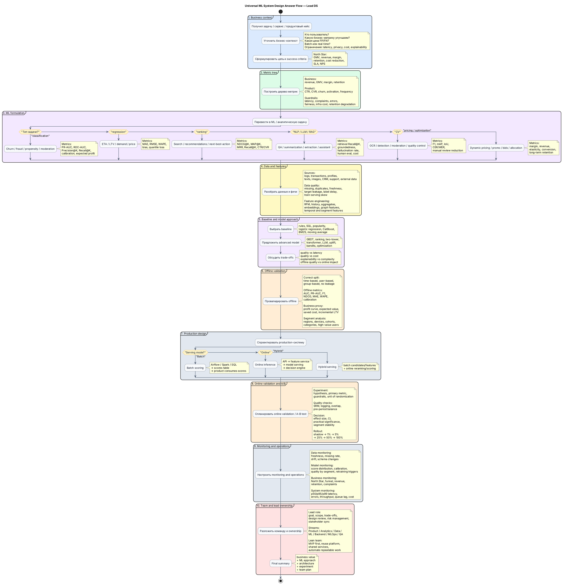
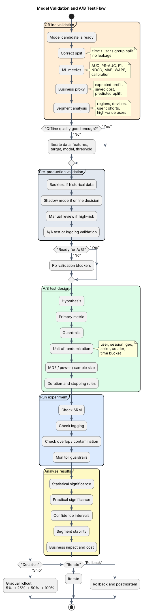
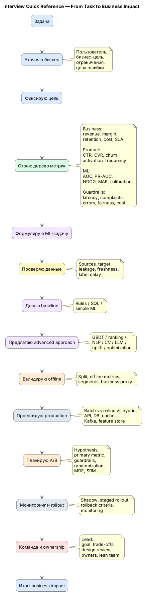

# ML System Design Interview Cheat Sheet — Lead DS / Analytics Developer

Редактируемый markdown-файл с диаграммами **PlantUML** для подготовки к ML System Design секции с упором на роль Lead DS.

## Как открыть preview в VS Code

Рекомендуемые расширения:

- **PlantUML** by jebbs
- **Markdown Preview Enhanced** или любой markdown preview, который умеет PlantUML
- Для рендера PlantUML локально может понадобиться Java + Graphviz

Обычно блоки в markdown пишутся так:

```plantuml
@startuml
...
@enduml
```



## Цветовая легенда

| Уровень | Цвет | Смысл |
|---|---:|---|
| Business | синий | бизнес-цель, пользователи, деньги, impact |
| Metrics | зелёный | продуктовые, ML, guardrail и системные метрики |
| Data | жёлтый | источники, фичи, качество данных, таргет |
| Model | фиолетовый | baseline, advanced models, ML formulation |
| Validation | оранжевый | offline validation, A/B, rollout |
| Production | серый | архитектура, API, storage, serving, monitoring |
| Team / Lead | красный | ownership, команда, риски, управление |

---

# 1. Главная схема: универсальный процесс ответа на ML/System Design секции



---

# 2. Дерево метрик для любого кейса

```plantuml
@startmindmap
title Metric Tree — Business → Product → ML → Guardrails → Decision

skinparam backgroundColor #FFFFFF
skinparam defaultFontName Inter
skinparam defaultFontSize 13
skinparam shadowing false

<style>
mindmapDiagram {
  node {
    BackgroundColor #F8FAFC
    LineColor #334155
    FontColor #0F172A
  }
  :depth(1) {
    BackgroundColor #DBEAFE
    LineColor #2563EB
  }
  :depth(2) {
    BackgroundColor #DCFCE7
    LineColor #16A34A
  }
  :depth(3) {
    BackgroundColor #FEF9C3
    LineColor #CA8A04
  }
}
</style>

* Metric Tree
** Business / North Star
*** Revenue / GMV
*** Margin / profit
*** Retention / churn
*** Cost reduction
*** SLA / quality of service
*** NPS / CSAT
** Product metrics
*** CTR
*** CVR
*** Activation
*** Frequency
*** Time to value
*** Funnel conversion
*** Complaint / refund / cancellation rate
** ML metrics
*** Classification
**** ROC-AUC
**** PR-AUC
**** Precision@K
**** Recall@K
**** F1
**** LogLoss
**** Calibration
*** Regression
**** MAE
**** RMSE
**** WAPE
**** MAPE
**** Bias
**** Quantile loss
*** Ranking
**** NDCG@K
**** MAP@K
**** MRR
**** Recall@K
**** Coverage
**** Diversity
*** Forecasting
**** WAPE
**** sMAPE
**** Bias
**** Backtest error
**** Stockout / overstock
*** NLP / LLM / RAG
**** Retrieval Recall@K
**** Groundedness
**** Hallucination rate
**** Human eval
**** Cost
*** CV
**** F1
**** mAP
**** IoU
**** OCR CER/WER
**** Manual review reduction
** Guardrails
*** Latency
*** Error rate
*** Infra cost
*** Fairness / segment degradation
*** Privacy / safety
*** Long-term retention
*** User complaints
** Operational / system metrics
*** p50 / p95 / p99 latency
*** Throughput / RPS
*** CPU / GPU utilization
*** Queue lag
*** Availability
*** Cost per prediction
** Diagnostic metrics
*** Data freshness
*** Missing rate
*** Feature drift
*** Score distribution drift
*** Train-serving skew
*** Label delay
*** Quality by segment
** Decision logic
*** Ship if business metric improves
*** Guardrails are stable
*** Effect is practically significant
*** Segments do not degrade
*** Cost is acceptable

@endmindmap
```



---

# 3. Как не потеряться в доменах и выбрать подход

```plantuml
@startuml
title Domain Decision Map — How to Pick ML Approach

skinparam backgroundColor #FFFFFF
skinparam shadowing false
skinparam roundcorner 18
skinparam defaultFontName Inter
skinparam defaultFontSize 13
skinparam ArrowColor #475569

skinparam rectangle {
  BorderColor #334155
  FontColor #0F172A
}

rectangle "Получили домен / задачу" as A #DBEAFE
diamond "Что нужно сделать?" as B #FEF3C7

rectangle "Classification\n\nExamples:\nchurn, fraud, propensity, moderation\n\nModels:\nLogReg, CatBoost, LightGBM, NN\n\nMetrics:\nPR-AUC, Precision@K, Recall@K,\ncalibration, expected profit" as C #F3E8FF

rectangle "Regression\n\nExamples:\nETA, LTV, demand, revenue\n\nModels:\nlinear, CatBoost, LightGBM,\nquantile regression\n\nMetrics:\nMAE, RMSE, WAPE, bias,\nquantile loss" as D #F3E8FF

rectangle "Ranking\n\nExamples:\nsearch, ads, candidates,\nnext-best-action\n\nModels:\nBM25, LambdaMART, CatBoostRanker,\nneural reranker\n\nMetrics:\nNDCG@K, MRR, MAP@K,\nCTR, CVR" as E #F3E8FF

rectangle "Recommendation System\n\nArchitecture:\ncandidate generation → ranker\n→ reranker → business rules\n\nModels:\npopular baseline, collaborative filtering,\ntwo-tower, ranker\n\nMetrics:\nCTR, CVR, GMV, retention,\ndiversity, coverage" as F #F3E8FF

rectangle "Forecasting\n\nExamples:\ndemand, load, supply, revenue\n\nModels:\nnaive, moving average, ARIMA,\nCatBoost with lags, deep forecasting\n\nMetrics:\nWAPE, sMAPE, bias,\nservice level" as G #F3E8FF

rectangle "NLP / LLM\n\nExamples:\nclassification, NER, RAG,\nassistant, summarization\n\nModels:\nTF-IDF baseline, BERT,\nembeddings, LLM, RAG\n\nMetrics:\nF1, retrieval Recall@K,\ngroundedness, hallucination rate,\nhuman eval" as H #F3E8FF

rectangle "CV\n\nExamples:\nOCR, detection, moderation, defects\n\nModels:\nCNN, YOLO, ViT, OCR pipeline\n\nMetrics:\nF1, mAP, IoU,\nCER/WER, manual review reduction" as I #F3E8FF

rectangle "Optimization / Pricing\n\nExamples:\ndynamic pricing, promo,\nrouting, allocation\n\nApproach:\nelasticity, causal inference,\nuplift, bandits, constrained optimization\n\nMetrics:\nmargin, revenue, conversion,\nretention, fairness" as J #F3E8FF

rectangle "Fraud / Anomaly Detection\n\nExamples:\npayments, abuse, fake accounts, spam\n\nApproach:\nrules + ML + graph features\n+ human review\n\nMetrics:\nprevented loss,\nPrecision@review_capacity,\nFPR, user friction" as K #F3E8FF

rectangle "Always connect to business value" as L #DCFCE7
rectangle "Then design:\ndata → model → validation → production → A/B → monitoring → team plan" as M #E2E8F0

A --> B
B --> C : вероятность события
B --> D : число
B --> E : порядок объектов
B --> F : рекомендации
B --> G : будущее по времени
B --> H : смысл из текста
B --> I : изображения
B --> J : цена / действие / ресурс
B --> K : аномалии / злоупотребления

C --> L
D --> L
E --> L
F --> L
G --> L
H --> L
I --> L
J --> L
K --> L
L --> M

@enduml
```

---

# 4. Production ML architecture с ветвлением batch / online / hybrid

```plantuml
@startuml
title Production ML Architecture — Batch / Online / Hybrid

skinparam backgroundColor #FFFFFF
skinparam shadowing false
skinparam roundcorner 18
skinparam defaultFontName Inter
skinparam defaultFontSize 13
skinparam ArrowColor #475569
skinparam ArrowThickness 1.3

skinparam component {
  BorderColor #334155
  FontColor #0F172A
}

left to right direction

package "Data ingestion" #DBEAFE {
  [Product / business event] as Event
  [Event logging] as Logging
  [Kafka / streaming\nclicks, transactions, feedback] as Kafka #FEF9C3
  database "Data Lake / DWH\nraw logs, transactions, profiles" as DWH #FEF9C3
}

package "Feature engineering" #FEF9C3 {
  [ETL / ELT\nSpark / SQL / Airflow] as ETL
  [Stream processing\nFlink / Spark Streaming / consumers] as Stream
  database "Offline Feature Store" as OFS
  database "Online Feature Store\nRedis / low-latency storage" as OnFS
}

package "Training and registry" #F3E8FF {
  [Training dataset builder] as Builder
  [Model training pipeline] as Train
  [Offline evaluation] as Eval
  diamond "Pass quality gate?" as Gate #FEF3C7
  [Model Registry\nversioning, metadata,\nmetrics, approval] as Registry
  [Iterate\ndata fixes, features,\nmodel, target] as Iterate #FFEDD5
}

package "Serving" #E2E8F0 {
  diamond "Serving mode?" as Mode #FEF3C7

  [Batch inference job\ndaily/hourly scoring] as Batch
  database "Scores table /\nrecommendations table" as Scores
  [Product backend reads\nprecomputed scores] as BatchProduct

  [Online model serving\nREST/gRPC service] as Online
  [Decision engine\nbusiness rules, thresholds, fallback] as Decision
  [Product API response] as Response

  [Batch candidates /\nheavy features] as HybridBatch
  [Online lightweight reranker] as Reranker
  [Final decision / response] as HybridResponse
}

package "Experiment and rollout" #FFEDD5 {
  [Experiment / rollout layer] as Experiment
  [Shadow mode] as Shadow
  [A/B test] as AB
  [Gradual rollout] as Rollout
  [Rollback if guardrails fail] as Rollback
}

package "Monitoring and feedback" #DCFCE7 {
  [Data monitoring\nfreshness, missing, drift, schema] as DataMon
  [Model monitoring\nscore drift, calibration,\nquality by segment] as ModelMon
  [Business monitoring\nrevenue, conversion,\nretention, complaints] as BizMon
  [System monitoring\nlatency, errors, RPS,\nqueue lag, cost] as SysMon
  [Feedback loop] as Feedback
}

Event --> Logging
Logging --> Kafka
Logging --> DWH

DWH --> ETL
Kafka --> Stream
ETL --> OFS
Stream --> OnFS

OFS --> Builder
Builder --> Train
Train --> Eval
Eval --> Gate

Gate --> Iterate : no
Iterate --> Builder

Gate --> Registry : yes
Registry --> Mode

Mode --> Batch : batch scoring
Batch --> Scores
Scores --> BatchProduct

Mode --> Online : online inference
OnFS --> Online
Online --> Decision
Decision --> Response

Mode --> HybridBatch : hybrid
HybridBatch --> Reranker
OnFS --> Reranker
Reranker --> HybridResponse

BatchProduct --> Experiment
Response --> Experiment
HybridResponse --> Experiment

Experiment --> Shadow
Experiment --> AB
Experiment --> Rollout
Experiment --> Rollback

Shadow --> DataMon
AB --> ModelMon
Rollout --> BizMon
Rollback --> SysMon

DataMon --> Feedback
ModelMon --> Feedback
BizMon --> Feedback
SysMon --> Feedback

Feedback --> DWH
Feedback --> Kafka

@enduml
```

---

# 5. Команда и роль лида без раздувания штата

```plantuml
@startuml
title Team and Lead Ownership — Lean Delivery Model

skinparam backgroundColor #FFFFFF
skinparam shadowing false
skinparam roundcorner 18
skinparam defaultFontName Inter
skinparam defaultFontSize 13
skinparam ArrowColor #475569

center header
Lead DS should own framing, trade-offs, interfaces, quality bar and business impact,
not become a bottleneck for every implementation detail.
endheader

rectangle "Lead / owner of initiative" as Lead #FEE2E2

package "1. Align business goal" #DBEAFE {
  rectangle "Stakeholders\nbusiness owner, product, operations" as B1
  rectangle "Definition of success\nbusiness metric + product metric + guardrails" as B2
  rectangle "Scope and non-goals\nwhat is MVP, what is later" as B3
}

package "2. Decompose workstreams" #FEF9C3 {
  rectangle "Product / Analytics stream\n\nmetric tree, dashboard,\nA/B design, interpretation" as S1
  rectangle "Data Engineering stream\n\ndata sources, ETL,\nfeature pipelines, data quality" as S2
  rectangle "ML / DS stream\n\nbaseline, features, model,\noffline validation" as S3
  rectangle "Backend / Integration stream\n\nAPI, product integration,\ndecision engine, fallback" as S4
  rectangle "MLOps / Platform stream\n\nserving, registry, CI/CD,\nmonitoring, retraining" as S5
  rectangle "QA / Risk / Legal stream\n\ntest scenarios, privacy,\nsafety, edge cases" as S6
}

package "3. Decision framework" #DCFCE7 {
  rectangle "Design doc" as D1
  rectangle "Architecture review" as D2
  rectangle "Experiment review" as D3
  rectangle "Launch checklist" as D4
  rectangle "Rollback criteria" as D5
}

package "4. Risk management" #FFEDD5 {
  rectangle "Business risks\nwrong metric, cannibalization, no ROI" as R1
  rectangle "Data risks\nleakage, bias, label delay, bad logging" as R2
  rectangle "Model risks\ndrift, poor calibration, segment degradation" as R3
  rectangle "System risks\nlatency, downtime, cost, scaling" as R4
  rectangle "Org risks\nunclear ownership, dependencies, overengineering" as R5
}

package "5. Keep team lean" #F3E8FF {
  rectangle "Use MVP first" as L1
  rectangle "Reuse existing platform and shared services" as L2
  rectangle "One owner per stream,\nnot one person per task" as L3
  rectangle "Automate repeatable work" as L4
  rectangle "Human-in-the-loop only\nwhere risk is high" as L5
  rectangle "Scale team only after\nbusiness value is proven" as L6
}

package "Expected lead behavior" #FEE2E2 {
  rectangle "Lead does not do everything personally" as E1
  rectangle "Lead owns problem framing,\ntrade-offs, interfaces and quality bar" as E2
  rectangle "Lead keeps the project moving\nunder uncertainty" as E3
  rectangle "Lead communicates impact to business\nand details to engineers" as E4
}

Lead --> B1
Lead --> B2
Lead --> B3

Lead --> S1
Lead --> S2
Lead --> S3
Lead --> S4
Lead --> S5
Lead --> S6

Lead --> D1
D1 --> D2
D2 --> D3
D3 --> D4
D4 --> D5

Lead --> R1
Lead --> R2
Lead --> R3
Lead --> R4
Lead --> R5

Lead --> L1
Lead --> L2
Lead --> L3
Lead --> L4
Lead --> L5
Lead --> L6

B2 --> E2
D1 --> E2
R1 --> E3
L1 --> E1
L2 --> E3
E1 --> E4
E2 --> E4
E3 --> E4

@enduml
```



---

# 6. Как отвечать на секции именно в течение 1 часа

```plantuml
@startuml
title 60-Minute Interview Answer Timeline

skinparam backgroundColor #FFFFFF
skinparam shadowing false
skinparam roundcorner 18
skinparam defaultFontName Inter
skinparam defaultFontSize 13
skinparam ArrowColor #475569

left to right direction

rectangle "0–5 min\nClarify" as T1 #DBEAFE
rectangle "5–10 min\nBusiness goal\nand metrics" as T2 #DCFCE7
rectangle "10–20 min\nData and ML\nformulation" as T3 #FEF9C3
rectangle "20–30 min\nBaseline and\nadvanced model" as T4 #F3E8FF
rectangle "30–40 min\nProduction\narchitecture" as T5 #E2E8F0
rectangle "40–48 min\nValidation\nand A/B" as T6 #FFEDD5
rectangle "48–55 min\nTeam plan\nand risks" as T7 #FEE2E2
rectangle "55–60 min\nSummary and\ntrade-offs" as T8 #DBEAFE

note bottom of T1
Ask about:
users, goal, constraints,
latency, error cost
end note

note bottom of T2
North Star,
product metrics,
ML metrics,
guardrails
end note

note bottom of T3
Sources, target,
features, leakage,
label delay
end note

note bottom of T4
Simple baseline first,
then better model
if ROI exists
end note

note bottom of T5
Batch vs online vs hybrid,
storage, API, cache,
queue, monitoring
end note

note bottom of T6
Offline validation,
shadow mode, A/B,
rollout, rollback
end note

note bottom of T7
Streams, owners,
MVP, dependencies,
lean team
end note

note bottom of T8
Tie everything back
to business result
end note

T1 --> T2
T2 --> T3
T3 --> T4
T4 --> T5
T5 --> T6
T6 --> T7
T7 --> T8

@enduml
```



---

# 7. A/B и валидация модели



---

# 8. Компактная схема для запоминания: Senior answer loop

```plantuml
@startuml
title Senior Answer Loop — One-Line Mental Model

skinparam backgroundColor #FFFFFF
skinparam shadowing false
skinparam roundcorner 20
skinparam defaultFontName Inter
skinparam defaultFontSize 13
skinparam ArrowColor #475569
skinparam ArrowThickness 1.5

left to right direction

rectangle "Business\n\nWhat value?" as A #DBEAFE
rectangle "Metrics\n\nHow measure?" as B #DCFCE7
rectangle "Data\n\nCan we trust data?" as C #FEF9C3
rectangle "Model\n\nBaseline first" as D #F3E8FF
rectangle "Validation\n\nOffline + segments" as E #FFEDD5
rectangle "Production\n\nBatch / online / hybrid" as F #E2E8F0
rectangle "Experiment\n\nA/B + guardrails" as G #FFEDD5
rectangle "Monitoring\n\nDrift + latency + business" as H #E2E8F0
rectangle "Team\n\nOwners + lean team" as I #FEE2E2
rectangle "Business impact\n\nROI + rollout" as J #DBEAFE

A --> B
B --> C
C --> D
D --> E
E --> F
F --> G
G --> H
H --> I
I --> J
J --> A

@enduml
```



---

# 9. Версия, которую можно держать перед глазами на собесе



---

# 10. Финальный фрейм, который стоит выучить

```text
Business → Metrics → Data → Model → Validation → Production → A/B → Monitoring → Team → Business Impact
```

## Как это звучит на интервью

> Я бы начал не с выбора модели, а с формализации бизнес-цели и цены ошибки. Затем построил бы дерево метрик: business, product, ML и guardrails. После этого проверил бы данные, leakage, задержку таргета и доступность фичей в момент принятия решения.
>
> Для MVP сделал бы простой baseline, чтобы быстро проверить гипотезу и получить нижнюю планку. Дальше выбрал бы модельный подход по типу задачи: classification, regression, ranking, NLP/CV, pricing или optimization.
>
> После offline validation я бы спроектировал production-контур: batch, online или hybrid serving, feature store, API, мониторинг, fallback и rollback. Решение о релизе принимал бы через A/B с primary metric, guardrails и проверкой практической значимости.
>
> Как lead я бы разложил работу на потоки, назначил owners, держал design review, управление рисками и связь с бизнес-метриками, не раздувая команду до доказанного business value.
