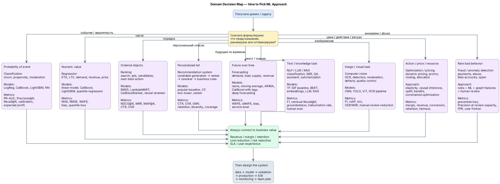
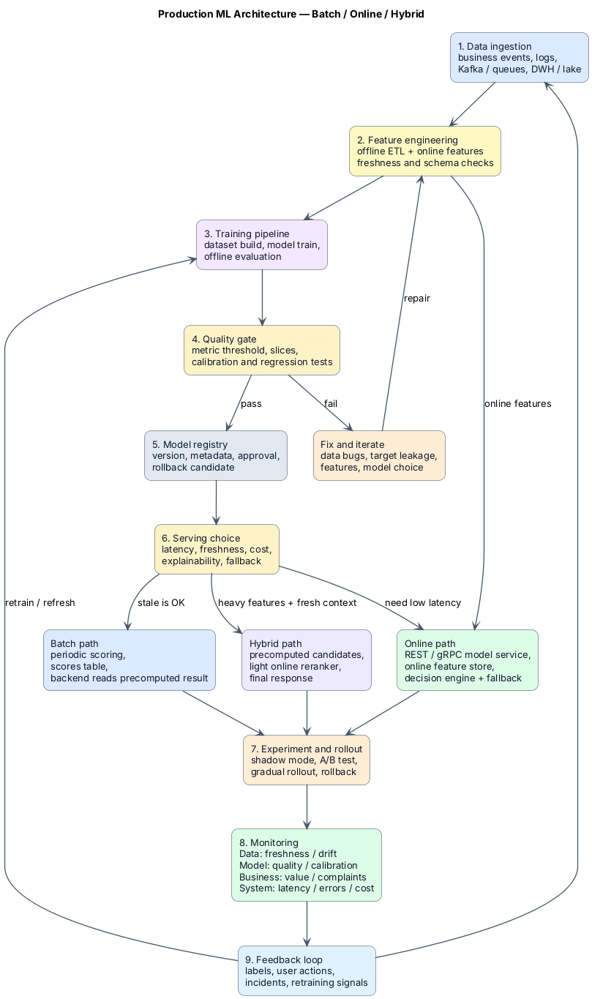
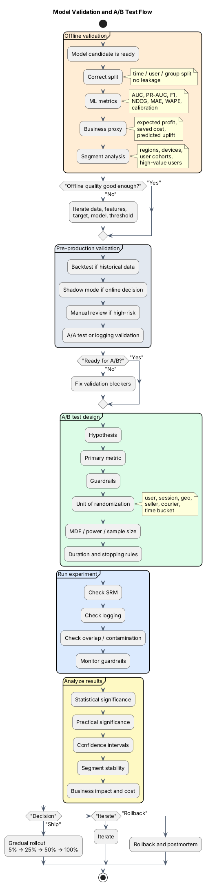
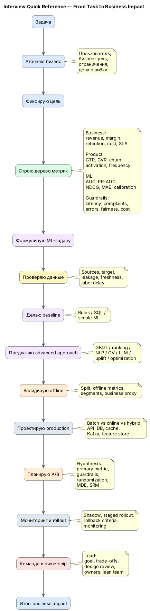

# ML System Design Interview Cheat Sheet — Lead DS / Analytics Developer

Редактируемый markdown-файл с диаграммами **PlantUML** для подготовки к ML System Design секции с упором на роль Lead DS.

## Как открыть preview в VS Code

Рекомендуемые расширения:

- **PlantUML** by jebbs
- **Markdown Preview Enhanced** или любой markdown preview, который умеет PlantUML
- Для рендера PlantUML локально может понадобиться Java + Graphviz

Обычно блоки в markdown пишутся так:

```plantuml
@startuml
...
@enduml
```



## Цветовая легенда

| Уровень | Цвет | Смысл |
|---|---:|---|
| Business | синий | бизнес-цель, пользователи, деньги, impact |
| Metrics | зелёный | продуктовые, ML, guardrail и системные метрики |
| Data | жёлтый | источники, фичи, качество данных, таргет |
| Model | фиолетовый | baseline, advanced models, ML formulation |
| Validation | оранжевый | offline validation, A/B, rollout |
| Production | серый | архитектура, API, storage, serving, monitoring |
| Team / Lead | красный | ownership, команда, риски, управление |

---

# 1. Главная схема: универсальный процесс ответа на ML/System Design секции

```plantuml
@startuml
title Universal ML System Design Answer Flow — Lead DS

skinparam backgroundColor #FFFFFF
skinparam shadowing false
skinparam roundcorner 20
skinparam defaultFontName Inter
skinparam defaultFontSize 13
skinparam ArrowColor #475569
skinparam ArrowThickness 1.4
skinparam linetype ortho

skinparam rectangle {
  BackgroundColor #F8FAFC
  BorderColor #334155
  FontColor #0F172A
}

skinparam note {
  BackgroundColor #FEF9C3
  BorderColor #CA8A04
  FontColor #0F172A
}

top to bottom direction

rectangle "1. Business context\n\nПолучить кейс\nУточнить пользователя, цель,\nцену ошибки и constraints" as Business #DBEAFE
note right of Business
  Questions:
  - Who is the user?
  - What business metric matters?
  - What is the cost of FP/FN?
  - Batch, online or hybrid?
  - Latency, privacy, cost, explainability?

  Success:
  GMV, revenue, margin,
  retention, cost reduction,
  SLA, NPS
end note

rectangle "2. Metric tree\n\nBusiness → Product → ML\n→ Guardrails → Decision" as Metrics #DCFCE7
note right of Metrics
  Business:
  revenue, GMV, margin, retention

  Product:
  CTR, CVR, churn,
  activation, frequency

  Guardrails:
  latency, complaints, errors,
  fairness, infra cost
end note

rectangle "3. ML formulation\n\nПеревести продуктовую цель\nв ML / analytics задачу" as MLForm #F3E8FF
note right of MLForm
  Task taxonomy:
  - Classification:
    churn, fraud, propensity, moderation
    PR-AUC, ROC-AUC, Precision@K, Recall@K

  - Regression:
    ETA, LTV, demand, price
    MAE, RMSE, WAPE, bias

  - Ranking / Recsys:
    search, recommendations, next-best-action
    NDCG@K, MAP@K, MRR, Recall@K

  - NLP / LLM / RAG:
    QA, extraction, assistant
    retrieval Recall@K, groundedness, hallucination

  - CV:
    OCR, detection, moderation
    F1, mAP, IoU, CER/WER

  - Pricing / optimization:
    promo, bids, allocation
    margin, revenue, elasticity, conversion
end note

rectangle "4. Data and features\n\nПроверить источники,\nтаргет, качество данных\nи доступность фичей" as Data #FEF9C3
note right of Data
  Sources:
  logs, transactions, profiles,
  texts, images, CRM, support

  Data risks:
  missing, duplicates, freshness,
  leakage, label delay,
  train-serving skew

  Features:
  RFM, history, aggregates,
  embeddings, graph, temporal,
  segment features
end note

rectangle "5. Baseline and model approach\n\nСначала простой baseline,\nзатем advanced model\nпри понятном ROI" as Model #F3E8FF
note right of Model
  Baseline:
  rules, SQL, popularity,
  logistic regression, CatBoost,
  BM25, moving average

  Advanced:
  GBDT, ranking, two-tower,
  transformer, LLM, uplift,
  bandits, optimization

  Trade-offs:
  quality vs latency/cost,
  explainability vs complexity,
  offline quality vs online impact
end note

rectangle "6. Offline validation\n\nПроверить качество,\nсегменты и business proxy\nдо production" as Offline #FFEDD5
note right of Offline
  Correct split:
  time-based, user-based,
  group-based, no leakage

  Metrics:
  AUC, PR-AUC, F1,
  NDCG, MAE, WAPE,
  calibration

  Business proxy:
  profit curve, expected value,
  saved cost, incremental LTV
end note

rectangle "7. Production design\n\nСпроектировать serving,\nfeatures, storage, API,\nfallback и rollback" as Production #E2E8F0
note right of Production
  Serving modes:

  Batch:
  Airflow / Spark / SQL
  → scores table
  → product consumes scores

  Online:
  API → feature service
  → model serving
  → decision engine

  Hybrid:
  batch candidates/features
  + online reranking/scoring
end note

rectangle "8. Online validation and A/B\n\nПроверить impact через\nshadow, A/A, A/B\nи staged rollout" as Online #FFEDD5
note right of Online
  Experiment:
  hypothesis, primary metric,
  guardrails, randomization unit

  Quality checks:
  SRM, logging, overlap,
  pre-period balance

  Decision:
  effect size, CI,
  practical significance,
  segment stability

  Rollout:
  shadow → 1% → 5%
  → 25% → 50% → 100%
end note

rectangle "9. Monitoring and operations\n\nСледить за data, model,\nbusiness и system health" as Monitoring #E2E8F0
note right of Monitoring
  Data:
  freshness, missing rate,
  drift, schema changes

  Model:
  score distribution,
  calibration, quality by segment,
  retraining triggers

  Business:
  North Star, funnel,
  revenue, retention, complaints

  System:
  p50/p95/p99 latency,
  errors, throughput, queue lag, cost
end note

rectangle "10. Team and lead ownership\n\nРазложить streams,\nowners, risks, reviews\nи lean delivery" as Team #FEE2E2
note right of Team
  Lead role:
  goal, scope, trade-offs,
  design review, risk management,
  stakeholder sync

  Streams:
  Product / Analytics / Data /
  ML / Backend / MLOps / QA

  Lean team:
  MVP first, reuse platform,
  shared services,
  automate repeatable work
end note

rectangle "Final summary\n\nBusiness value\n+ ML approach\n+ architecture\n+ experiment\n+ team plan" as Summary #DBEAFE

Business --> Metrics
Metrics --> MLForm
MLForm --> Data
Data --> Model
Model --> Offline
Offline --> Production
Production --> Online
Online --> Monitoring
Monitoring --> Team
Team --> Summary
@enduml
```



---

# 2. Дерево метрик для любого кейса

```plantuml
@startmindmap
title Metric Tree — Business → Product → ML → Guardrails → Decision

skinparam backgroundColor #FFFFFF
skinparam defaultFontName Inter
skinparam defaultFontSize 13
skinparam shadowing false

<style>
mindmapDiagram {
  node {
    BackgroundColor #F8FAFC
    LineColor #334155
    FontColor #0F172A
  }
  :depth(1) {
    BackgroundColor #DBEAFE
    LineColor #2563EB
  }
  :depth(2) {
    BackgroundColor #DCFCE7
    LineColor #16A34A
  }
  :depth(3) {
    BackgroundColor #FEF9C3
    LineColor #CA8A04
  }
}
</style>

* Metric Tree
** Business / North Star
*** Revenue / GMV
*** Margin / profit
*** Retention / churn
*** Cost reduction
*** SLA / quality of service
*** NPS / CSAT
** Product metrics
*** CTR
*** CVR
*** Activation
*** Frequency
*** Time to value
*** Funnel conversion
*** Complaint / refund / cancellation rate
** ML metrics
*** Classification
**** ROC-AUC
**** PR-AUC
**** Precision@K
**** Recall@K
**** F1
**** LogLoss
**** Calibration
*** Regression
**** MAE
**** RMSE
**** WAPE
**** MAPE
**** Bias
**** Quantile loss
*** Ranking
**** NDCG@K
**** MAP@K
**** MRR
**** Recall@K
**** Coverage
**** Diversity
*** Forecasting
**** WAPE
**** sMAPE
**** Bias
**** Backtest error
**** Stockout / overstock
*** NLP / LLM / RAG
**** Retrieval Recall@K
**** Groundedness
**** Hallucination rate
**** Human eval
**** Cost
*** CV
**** F1
**** mAP
**** IoU
**** OCR CER/WER
**** Manual review reduction
** Guardrails
*** Latency
*** Error rate
*** Infra cost
*** Fairness / segment degradation
*** Privacy / safety
*** Long-term retention
*** User complaints
** Operational / system metrics
*** p50 / p95 / p99 latency
*** Throughput / RPS
*** CPU / GPU utilization
*** Queue lag
*** Availability
*** Cost per prediction
** Diagnostic metrics
*** Data freshness
*** Missing rate
*** Feature drift
*** Score distribution drift
*** Train-serving skew
*** Label delay
*** Quality by segment
** Decision logic
*** Ship if business metric improves
*** Guardrails are stable
*** Effect is practically significant
*** Segments do not degrade
*** Cost is acceptable

@endmindmap
```



---

# 3. Как не потеряться в доменах и выбрать подход



---

# 4. Production ML architecture с ветвлением batch / online / hybrid



---

# 5. Команда и роль лида без раздувания штата

```plantuml
@startuml
title Team and Lead Ownership — Lean Delivery Model

skinparam backgroundColor #FFFFFF
skinparam shadowing false
skinparam roundcorner 18
skinparam defaultFontName Inter
skinparam defaultFontSize 13
skinparam ArrowColor #475569
skinparam ArrowThickness 1.3
skinparam linetype ortho

skinparam rectangle {
  BorderColor #334155
  FontColor #0F172A
}

center header
Lead DS should own framing, trade-offs, interfaces, quality bar and business impact,
not become a bottleneck for every implementation detail.
endheader

top to bottom direction

rectangle "Lead / owner of initiative\n\nOwn the problem framing,\ntrade-offs, interfaces,\nquality bar and business impact" as Lead #FEE2E2

rectangle "1. Align business goal\n\nStakeholders:\nbusiness owner, product,\noperations, engineering\n\nDefinition of success:\nbusiness metric + product metric + guardrails\n\nScope:\nMVP now, explicit non-goals,\nlater iterations" as Goal #DBEAFE

rectangle "2. Decompose workstreams\n\nProduct / Analytics:\nmetric tree, dashboard, A/B design\n\nData Engineering:\nsources, ETL, feature pipelines, quality\n\nML / DS:\nbaseline, features, model, offline validation\n\nBackend / Integration:\nAPI, product integration, decision engine, fallback\n\nMLOps / Platform:\nserving, registry, CI/CD, monitoring\n\nQA / Risk / Legal:\ntests, privacy, safety, edge cases" as Streams #FEF9C3

rectangle "3. Decision framework\n\nDesign doc:\ngoal, metric tree, data,\nmodel, architecture, risks\n\nReview gates:\narchitecture review, experiment review,\nlaunch readiness\n\nLaunch control:\nstaged rollout, guardrails,\nrollback owner and criteria" as Decisions #DCFCE7

rectangle "4. Risk management\n\nBusiness:\nwrong metric, cannibalization, no ROI\n\nData:\nleakage, bias, label delay, bad logging\n\nModel:\ndrift, poor calibration, segment degradation\n\nSystem:\nlatency, downtime, cost, scaling\n\nOrganization:\nunclear ownership, dependencies, overengineering" as Risks #FFEDD5

rectangle "5. Keep team lean\n\nDo:\nuse existing platform, share services,\nautomate repeatable work,\nuse human-in-the-loop only where risk is high\n\nAvoid:\none person per tiny task,\ncustom platform too early,\nscaling team before business value is proven" as Lean #F3E8FF

rectangle "6. Expected lead behavior\n\nLead does not do everything personally.\n\nLead owns:\nframing, trade-offs, interfaces,\nquality bar, risk management\n\nLead communicates:\nimpact to business\nand details to engineers" as Behavior #FEE2E2

rectangle "Interview takeaway\n\nKeep the project moving with clear owners,\nexplicit risks, small MVP,\nreviews and measurable impact" as Takeaway #DBEAFE

Lead --> Goal
Goal --> Streams
Streams --> Decisions
Decisions --> Risks
Risks --> Lean
Lean --> Behavior
Behavior --> Takeaway

@enduml
```



---

# 6. Как отвечать на секции именно в течение 1 часа

```plantuml
@startuml
title 60-Minute Interview Answer Timeline

skinparam backgroundColor #FFFFFF
skinparam shadowing false
skinparam roundcorner 18
skinparam defaultFontName Inter
skinparam defaultFontSize 13
skinparam ArrowColor #475569

left to right direction

rectangle "0–5 min\nClarify" as T1 #DBEAFE
rectangle "5–10 min\nBusiness goal\nand metrics" as T2 #DCFCE7
rectangle "10–20 min\nData and ML\nformulation" as T3 #FEF9C3
rectangle "20–30 min\nBaseline and\nadvanced model" as T4 #F3E8FF
rectangle "30–40 min\nProduction\narchitecture" as T5 #E2E8F0
rectangle "40–48 min\nValidation\nand A/B" as T6 #FFEDD5
rectangle "48–55 min\nTeam plan\nand risks" as T7 #FEE2E2
rectangle "55–60 min\nSummary and\ntrade-offs" as T8 #DBEAFE

note bottom of T1
Ask about:
users, goal, constraints,
latency, error cost
end note

note bottom of T2
North Star,
product metrics,
ML metrics,
guardrails
end note

note bottom of T3
Sources, target,
features, leakage,
label delay
end note

note bottom of T4
Simple baseline first,
then better model
if ROI exists
end note

note bottom of T5
Batch vs online vs hybrid,
storage, API, cache,
queue, monitoring
end note

note bottom of T6
Offline validation,
shadow mode, A/B,
rollout, rollback
end note

note bottom of T7
Streams, owners,
MVP, dependencies,
lean team
end note

note bottom of T8
Tie everything back
to business result
end note

T1 --> T2
T2 --> T3
T3 --> T4
T4 --> T5
T5 --> T6
T6 --> T7
T7 --> T8

@enduml
```



---

# 7. A/B и валидация модели



---

# 8. Компактная схема для запоминания: Senior answer loop

```plantuml
@startuml
title Senior Answer Loop — One-Line Mental Model

skinparam backgroundColor #FFFFFF
skinparam shadowing false
skinparam roundcorner 20
skinparam defaultFontName Inter
skinparam defaultFontSize 13
skinparam ArrowColor #475569
skinparam ArrowThickness 1.5

left to right direction

rectangle "Business\n\nWhat value?" as A #DBEAFE
rectangle "Metrics\n\nHow measure?" as B #DCFCE7
rectangle "Data\n\nCan we trust data?" as C #FEF9C3
rectangle "Model\n\nBaseline first" as D #F3E8FF
rectangle "Validation\n\nOffline + segments" as E #FFEDD5
rectangle "Production\n\nBatch / online / hybrid" as F #E2E8F0
rectangle "Experiment\n\nA/B + guardrails" as G #FFEDD5
rectangle "Monitoring\n\nDrift + latency + business" as H #E2E8F0
rectangle "Team\n\nOwners + lean team" as I #FEE2E2
rectangle "Business impact\n\nROI + rollout" as J #DBEAFE

A --> B
B --> C
C --> D
D --> E
E --> F
F --> G
G --> H
H --> I
I --> J
J --> A

@enduml
```



---

# 9. Версия, которую можно держать перед глазами на собесе



---

# 10. Финальный фрейм, который стоит выучить

```text
Business → Metrics → Data → Model → Validation → Production → A/B → Monitoring → Team → Business Impact
```

## Как это звучит на интервью

> Я бы начал не с выбора модели, а с формализации бизнес-цели и цены ошибки. Затем построил бы дерево метрик: business, product, ML и guardrails. После этого проверил бы данные, leakage, задержку таргета и доступность фичей в момент принятия решения.
>
> Для MVP сделал бы простой baseline, чтобы быстро проверить гипотезу и получить нижнюю планку. Дальше выбрал бы модельный подход по типу задачи: classification, regression, ranking, NLP/CV, pricing или optimization.
>
> После offline validation я бы спроектировал production-контур: batch, online или hybrid serving, feature store, API, мониторинг, fallback и rollback. Решение о релизе принимал бы через A/B с primary metric, guardrails и проверкой практической значимости.
>
> Как lead я бы разложил работу на потоки, назначил owners, держал design review, управление рисками и связь с бизнес-метриками, не раздувая команду до доказанного business value.
